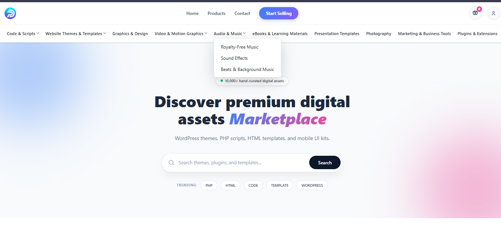
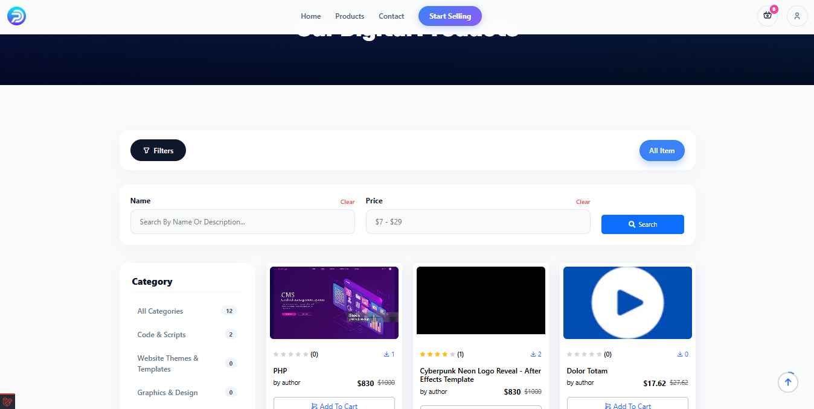
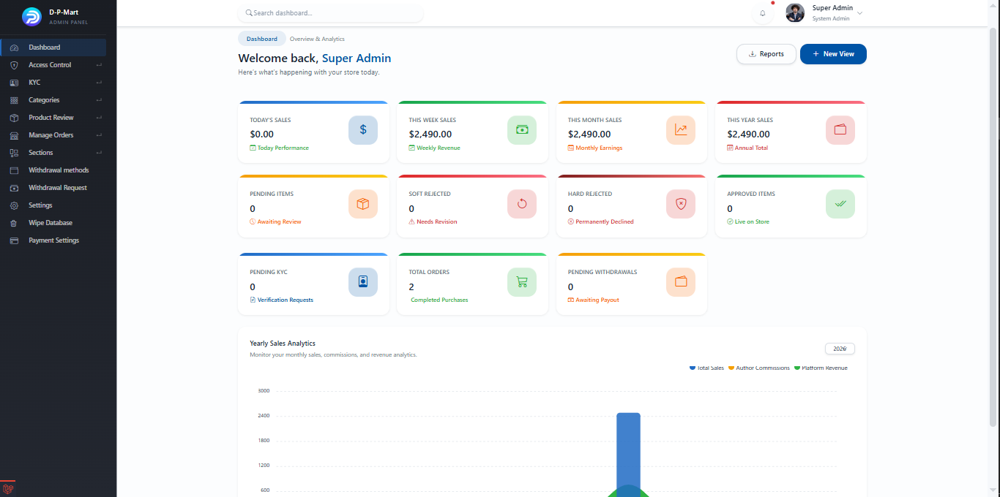
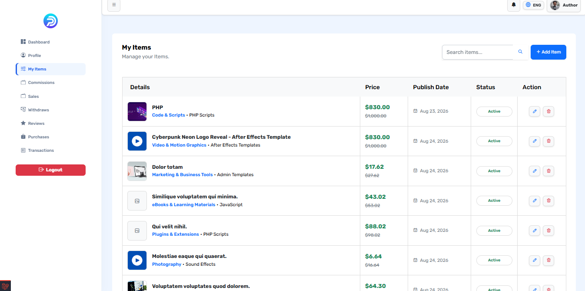
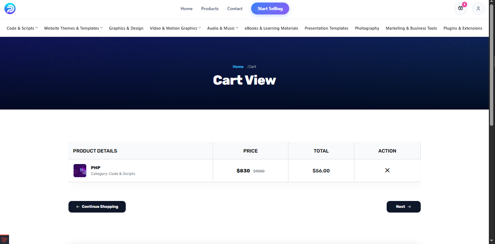
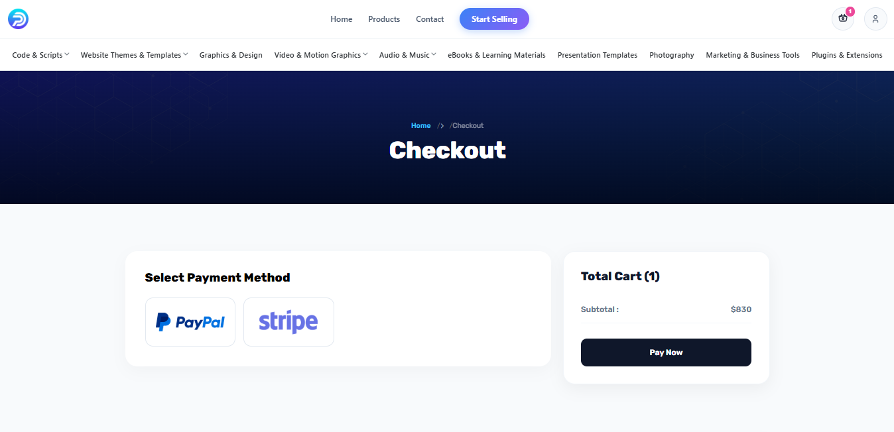
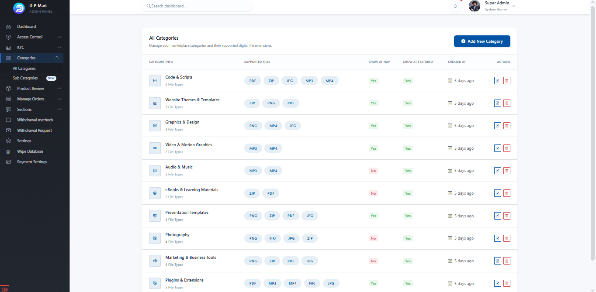
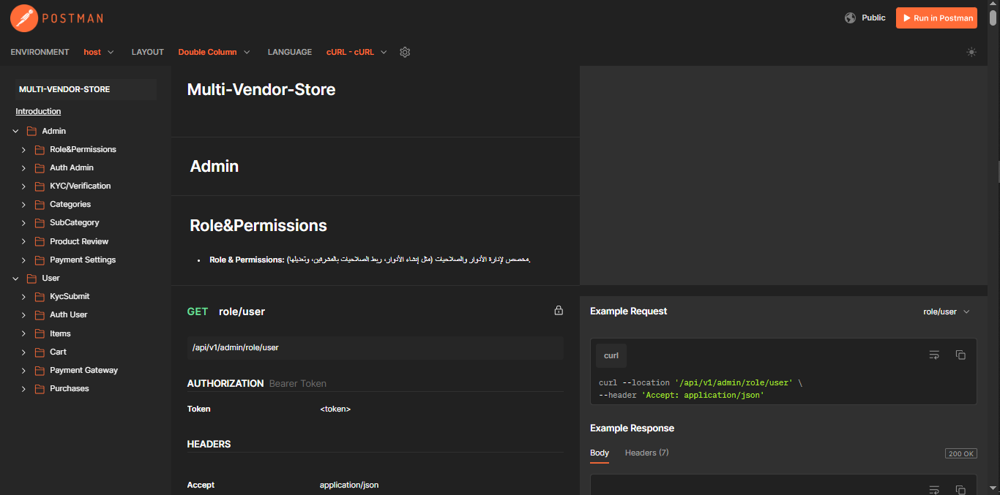

# 🚀 Pulse - Enterprise-Grade Multi-Vendor Digital Marketplace

<p align="center">
  
  
  
  
  <a href="https://documenter.getpostman.com/view/36684922/2sBYAuRWMz"></a>
</p>

<p align="center">
  <b>A highly scalable, robust, and feature-rich Multi-Vendor Digital Marketplace built with Laravel.</b><br>
  This platform empowers authors to sell digital products (scripts, themes, audio, video) while providing a seamless purchasing experience for users and comprehensive, data-driven management tools for administrators.
</p>

---

## 📸 Platform Preview

<table align="center">
  <tr>
    <td align="center"><b>🏠 Homepage</b><br></td>
    <td align="center"><b>🛍️ Product Page</b><br></td>
  </tr>
  <tr>
    <td align="center"><b>🛡️ Admin Dashboard (Analytics)</b><br></td>
    <td align="center"><b>👨‍💻 Author/Vendor Inventory</b><br></td>
  </tr>
  <tr>
    <td align="center"><b>🛒 Dynamic Cart & Checkout</b><br></td>
    <td align="center"><b>💳 Secure Payment Gateway</b><br></td>
  </tr>
  <tr>
    <td align="center"><b>📂 Category Management</b><br></td>
    <td align="center"><b>🔌 API Documentation</b><br></td>
  </tr>
</table>

---

## 🏗️ Software Architecture & Design Patterns

Built with scalability and maintainability in mind, the backend strictly follows the **Repository** and **Service** patterns. This ensures thin controllers, reusable business logic, and a decoupled data access layer.

```text
📦 Pulse-Marketplace
 ┣ 📂 app
 ┃ ┣ 📂 Http
 ┃ ┃ ┣ 📂 Controllers (Separated: Admin, Frontend, Vendor API logic)
 ┃ ┃ ┗ 📂 Requests (Form Request Validation for robust security)
 ┃ ┣ 📂 Models (Eloquent ORM, Polymorphic Relations, Soft Deletes)
 ┃ ┣ 📂 Repositories (Data Access Layer - abstracts DB queries) 🚀
 ┃ ┣ 📂 Services (Core Business Logic & 3rd Party Integrations) 🚀
 ┃ ┗ 📂 Traits (Reusable behaviors e.g., FileUploadTrait)
 ┣ 📂 database (Migrations, Advanced Seeders, Model Factories)
 ┣ 📂 public/docs (Assets & Readme Screenshots)
 ┗ 📂 routes (Modular routing for Web & RESTful API)


🔌 RESTful API DocumentationThe platform's core functionalities are exposed via a highly structured and secure RESTful API, fully documented using Postman.👉 Explore the Complete API Documentation✨ Enterprise-Grade Features🛡️ Admin & Super-Admin CapabilitiesAdvanced Multi-Auth System: Secure separation of concerns using guards (Admin, Author, User).Role-Based Access Control (RBAC): Granular permissions and dynamic role assignment.KYC Verification System: Built-in identity verification workflow to ensure vendor authenticity.Financial Intelligence Dashboard: Advanced analytics, revenue tracking, and commission management.Automated Withdrawal Management: Handle, approve, and process vendor payout requests securely.💼 Vendor (Author) EcosystemComprehensive Product Management: Upload and manage digital items (Images, Videos, Audio, ZIP files) with dynamic preview generation.Real-Time Sales Reports: Track earnings, commissions, and sales history via a dedicated dashboard.Flexible Withdrawal System: Request payouts via multiple configured payment gateways seamlessly.🛒 End-User ExperienceDynamic Cart System: AJAX-powered smooth shopping cart logic.Multi-Gateway Checkout: Secure checkout integration utilizing Stripe and PayPal.Digital Assets Library: Detailed transaction history and instant access to downloadable licenses post-purchase.Rating & Review System: Authenticated ability to rate and review purchased digital items.🛠️ Tech Stack & SecurityBackend Engine: PHP 8.x, Laravel 11.xFrontend: Laravel Blade, Bootstrap 5, AJAX/jQueryDatabase Engine: MySQL (Leveraging Advanced Joins, Polymorphic Relations, Soft Deletes, Indexing)Performance Optimization: Redis (Caching), Laravel Queues & Jobs (Background Processing for Mailing & Image tasks)Security Measures: CSRF Protection, XSS Prevention, Strict Input Validation (Form Requests), Gates & Policies for Authorization, API Rate Limiting.🔐 Demo Credentials (Seeded)Execute the seeders during installation to test the platform instantly with these demo accounts:RoleEmailPasswordAdminadmin@admin.compasswordVendorvendor@vendor.compasswordUseruser@user.compassword⚙️ Installation & SetupFollow these steps to get the project running on your local machine:Bash# 1. Clone the repository and navigate to the directory
git clone [https://github.com/devAbdallahAhmed/Multi-Vendor-Digital-Marketplace.git](https://github.com/devAbdallahAhmed/Multi-Vendor-Digital-Marketplace.git)
cd Multi-Vendor-Digital-Marketplace

# 2. Install Backend & Frontend Dependencies
composer install
npm install
npm run build

# 3. Configure Environment Variables (Crucial: Add DB credentials & Stripe keys)
cp .env.example .env
php artisan key:generate

# 4. Run Migrations & Seeders to populate dummy data and roles
php artisan migrate --seed

# 5. Link Storage (Required for displaying images & digital products)
php artisan storage:link

# 6. Start the Local Development Server
php artisan serve
🌐 Live Preview: Visit http://127.0.0.1:8000 in your browser to view the application.Engineered with ❤️ by Abdullah AhmedBackend Software Developer | PHP & Laravel Specialist
